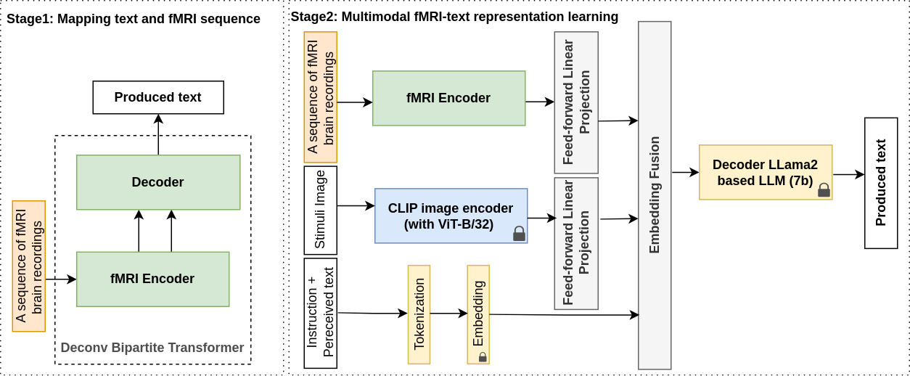

# Implementation code of the paper: A Multimodal LLM for the Non-Invasive Decoding of Spoken Text from Brain Recordings


## Requirements
```bash
python install -r requirement.txt
```

* Download vicuna-7b-v1.3 from https://huggingface.co/lmsys/vicuna-7b-v1.3 in the folder llm
* Download CLIP in the main folder: git clone https://github.com/openai/CLIP


## Preprocessing raw data:
* Create a folder “data/raw_data/fMRI_data” and upload the latest version of the raw fMRI from the OpenNeuro platform to it:
https://openneuro.org/datasets/ds001740/versions/2.2.0

* Create a folder “data/raw_data/transcriptions and upload the latest version of the raw Transcriptions from the Ortolang platform to it:
https://www.ortolang.fr/market/corpora/convers/v2?path=%2FTranscriptions

* Preprocessing raw 4D voxel BOLD signals:
```bash
python src/process_raw_bold_signal.py
python src/data_builder_tools/split_bold_files.py
```

## Processing and building training data
```bash
python src/data_builder_tools/split_bold_files.py
python src/data_builder_tools/textgrid_to_text.py
python src/data_builder_tools/build_data.py
python src/data_builder_tools/build_tokenizer.py
```

## Train and test MLLMs
```bash
  python trainer.py [-h]
                    [--model_name {MllmBrainToTextV0, MllmBrainToTextV1, MllmBrainToTextV2}]
                    [--test]
                    [--retrain]
                    [--batch_size BATCH_SIZE]
                    [--starting_epoch STARTING_EPOCH]
                    [--starting_epoch SAVE_ITERS]
                    [--epochs EPOCHS]
                    [--saved_checkpoint SAVED_CHECKPOINT]
  Arguments:
    --batch_size BATCH_SIZE
    --model_name {MllmBrainToTextV0, MllmBrainToTextV1, MllmBrainToTextV2}   name of the model to train.
    --test                test the model
    --retrain             retrain from existing checkpoint
    --starting_epoch      starting epoch in case of retrain is True
    --save_epochs         number of epochs before saving the checkpoint
    --epochs              number of training epochs
    --saved_checkpoint    filename of the trained model in case of “retrain“ or “test“ is True
```


## Train and test Transformer-based models

```bash
python  train_transformers.py [-h] [-seed SEED] [--test] [--retrain] [--load]
                             [--model_name {Transformer,CNNTransformer,DuplexTransformerConv,BipartiteTransformerConv,DeconvBipartiteTransformerConv}]
```   
* Example:
```bash
python  train_transformers.py -m DeconvBipartiteTransformerConv]
```   
```bash
python  train_transformers.py -m DeconvBipartiteTransformerConv --test
```   


## Evaluation / Benchmarking
```bash
python src/evaluation.py
```

## Download Trained Models
https://drive.google.com/drive/folders/1voveGzNPEGqK-ceXZbMv48uDtmFd23Op

## Additional Notes
* The structure of this repository is in work progress
* Some parts of the code of his project are adapted from InstructBlip (https://github.com/salesforce/LAVIS/blob/main/projects/instructblip/README.md), we thank the authors for their great work.
